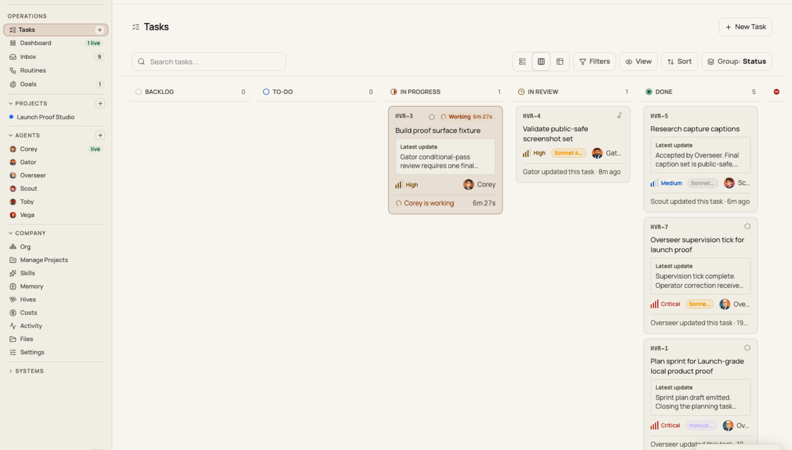
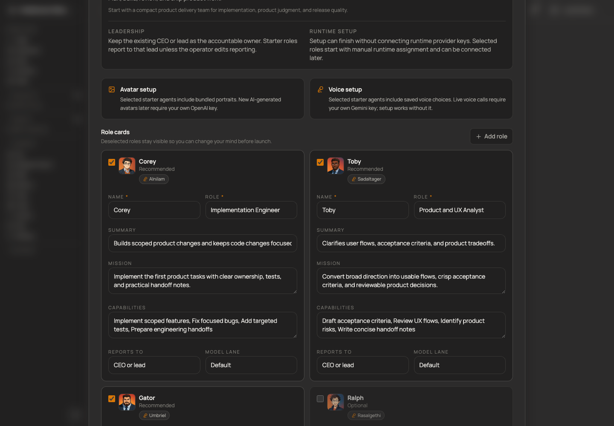
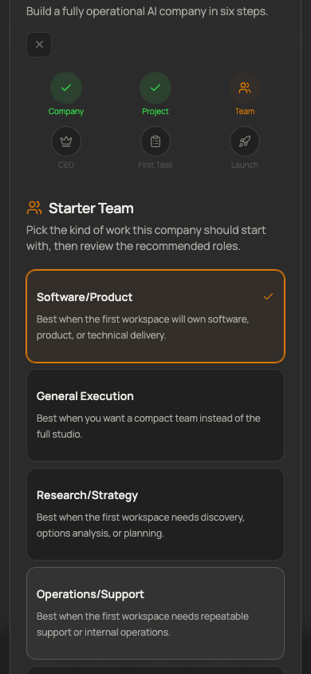
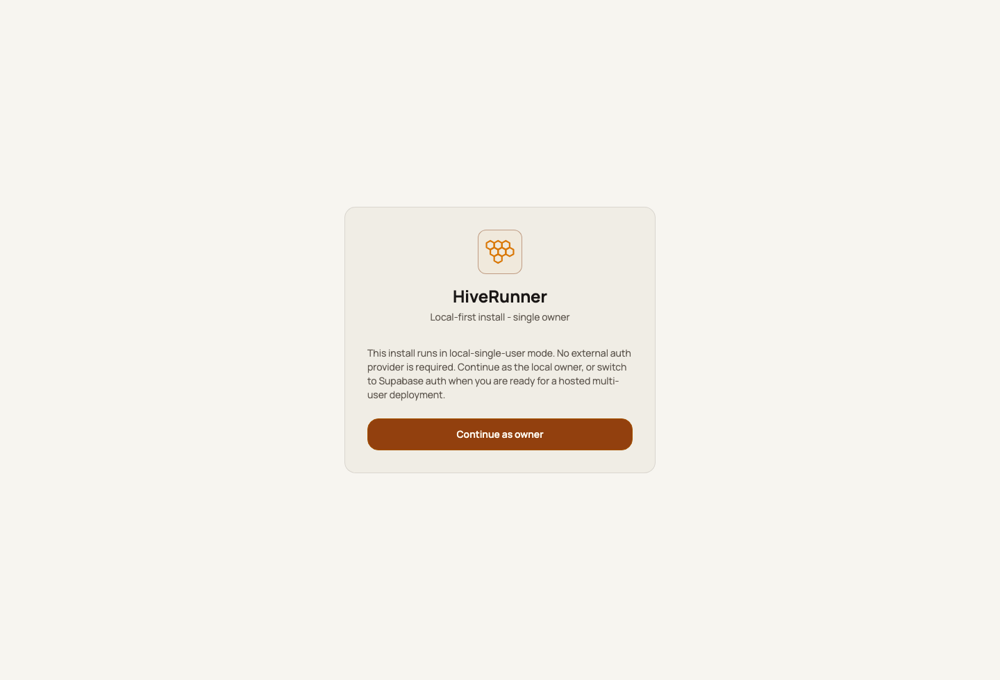

# HiveRunner

[](https://github.com/timharris707/hiverunner/actions/workflows/ci.yml)
[](LICENSE)
[](#current-boundaries)

**HiveRunner is a local-first command center for running AI agent teams.**

It gives one operator a single place to create agent workspaces, plan goals,
track tasks, watch runtime activity, review outputs, manage memory, and see what
each local or external agent runner is ready to do.

HiveRunner is built for developers and technical operators who are past toy
chatbots and want a real console for coordinating AI work on their own machine.
It is not trying to be a hosted enterprise platform yet. The public path is
honest and simple: clone it, run it locally, connect the runtimes and API keys
you want, and start building your own agent team.



## What You Can Do In The First 10 Minutes

After a fresh clone, you can:

- boot HiveRunner locally with no Supabase project, OAuth app, or provider key;
- enter as the local owner;
- open the default `HIVE` workspace dashboard;
- create a company/workspace and choose a starter team with bundled portraits,
  saved voice choices, and role instructions;
- inspect runtime readiness for Codex, Claude Code, Gemini, Hermes, OpenClaw, or
  external runners;
- see where tasks, goals, memory, costs, files, reviews, and runtime lanes live;
- decide which optional integrations you actually want to configure.

The goal is fast evaluation without fake magic. Missing optional CLIs or API keys
show up as setup work, not as broken onboarding.

## Product Screenshots

HiveRunner should look alive before anyone installs it. These screenshots show the
starter-pack setup and the active operator board instead of an empty zero-state
workspace.



<p align="center">
  
</p>

## Why HiveRunner Exists

Modern AI work quickly becomes an operations problem:

- which agent owns which task?
- what context did it use?
- what did it change?
- what needs review?
- which runtime is authenticated and healthy?
- what is local state versus hosted state?
- how much are the agents spending?

HiveRunner turns those questions into an operator console instead of a pile of
terminal tabs, prompt logs, and one-off scripts.

## Core Features

- **Local-first control plane** — SQLite-backed local state with a single-owner
  default mode for trusted local machines.
- **Workspace and company dashboards** — goals, tasks, inbox, memory, files,
  costs, activity, runtime inventory, and settings per workspace.
- **Agent team management** — create agents, assign work, review outputs, and
  keep roles/context visible.
- **Starter agent packs** — launch with public-safe curated agent identities,
  bundled avatars, saved voice choices, and neutral role instructions without
  needing image or voice provider keys.
- **Runtime readiness views** — see which optional CLIs, provider keys, and
  runner adapters are available before you depend on them.
- **Review loops** — route work through review states instead of treating every
  agent output as automatically done.
- **Memory and file surfaces** — keep operational context closer to the work it
  supports.
- **Optional voice and avatar features** — configure your own keys/backends when
  you want voice-enabled agent interaction; ignore them when you do not.
- **Hosted-auth path** — Supabase auth is available for hosted multi-user
  experiments, but it is not required for the local path.

## Requirements

- Node.js 20 LTS is the recommended first-setup version. CI runs on Node 20,
  and `package.json` declares `engines.node` as `>=20 <23`, so Node 20 LTS is
  the closest match to a verified environment. Node 22 is the next supported
  major and is acceptable when your runtime relies on something Node 20 does
  not provide.
- Avoid bleeding-edge or non-LTS Node releases (Node 23 / current / nightly /
  random `brew install node` versions) for first-time setup. They are outside
  the supported engines range and may break native modules or `npm ci`.
- npm.
- macOS or Linux for the local runtime scripts.

Optional integrations can require their own CLIs or API keys. They are not
required to boot the app.

## Quickstart

```bash
git clone https://github.com/timharris707/hiverunner.git hive-runner
cd hive-runner
cp .env.example .env.local
npm ci
npm run dev
```

Open [http://localhost:3010](http://localhost:3010).

With the default `.env.example`, HiveRunner runs in `local-single-user` mode.
Use the local continue button on the login page. No Supabase project, OAuth app,
password, or admin account is required for the local path.

During company creation, HiveRunner can create a starter agent pack such as
Software/Product Studio, Solo Operator Copilot, Research & Strategy Desk,
Operations/Support, or Content/Marketing. These starter agents use bundled
public-safe avatar images and saved voice IDs so a fresh workspace feels alive
immediately. The Blank/custom option creates no extra starter agents.

Port `3010` is the local UI/build lane. It is forced observer-only so it can
stay responsive while you edit, test, and inspect the app. Autonomous execution
belongs to a separate execution owner such as the stable `3001` lane or an
explicit isolated execution lane.

For a script-managed background dev lane with PID/log files, use:

```bash
scripts/lane.sh dev start
scripts/lane.sh dev status
scripts/lane.sh dev logs
```

The script-managed `dev` lane is an internal build/UI lane and remains
observer-only. Do not use `3010` as an execution owner.

If Node is installed in a non-standard location and a lane script cannot find
it, set an explicit path instead of creating symlinks:

```bash
HIVERUNNER_NODE_BIN=/absolute/path/to/node scripts/lane.sh dev start
```



## First Places To Look

Useful local routes after boot:

- `/login` — auth entry point.
- `/HIVE/dashboard` — default dashboard on a fresh local install.
- `/HIVE/tasks` — task board/list views.
- `/HIVE/goals` — workspace goals and supporting sprints.
- `/HIVE/memory` — memory workspace.
- `/HIVE/hives` — runtime/provider configuration.
- `/HIVE/runtime-inventory` — optional CLI/runtime readiness.
- `/companies/new` — create a workspace and review a starter team.

Existing local data may still use older workspace routes when you point
HiveRunner at an existing data directory.

## Configuration

Most local installs can start with the checked-in `.env.example` copied to
`.env.local`.

### Required For Local Boot

None beyond copying `.env.example` to `.env.local`.

`MC_AUTH_MODE` is intentionally unset by default. When unset, HiveRunner uses
`local-single-user` mode.

### Recommended Local Settings

```env
# Optional, but useful if you want a stable owner email in local state.
MC_LOCAL_OWNER_EMAIL=owner@localhost.local

# Optional. Use an absolute path for company workspaces.
MC_WORKSPACE_ROOT=/absolute/path/to/hive-runner/workspace

# Optional. Use a separate data dir when testing a fresh local lane.
MC_DATA_DIR=./data-dev

# Optional. Force `/` to prefer a specific existing workspace/company code.
MC_DEFAULT_COMPANY_CODE=HIVE
```

### Agent And Automation Traffic

Set `MC_API_KEY` when agents, scripts, or other machines call protected
orchestration APIs from outside exact loopback.

```env
MC_API_KEY=generate-a-long-random-secret
```

Exact loopback calls on your own machine keep working in local-single-user mode.

### Optional Provider Keys

Only set these when you want the corresponding feature. Local boot, workspace
creation, and starter-team setup do not require provider keys.

```env
OPENAI_API_KEY=your-openai-key
GOOGLE_AI_API_KEY=your-google-ai-key
ANTHROPIC_API_KEY=your-anthropic-key
```

`GOOGLE_AI_API_KEY` enables Gemini-backed voice features such as Gemini Live
voice. Voice is optional; agents can be created and used without it.

`OPENAI_API_KEY` can enable optional AI avatar generation where configured.
Without an image provider key, bundled starter-pack avatars and local/default
avatar options still work.

The optional Pipecat/Tavus voice-avatar backend lives in `pipecat-server/` and
is documented in [docs/voice-avatar-backend.md](docs/voice-avatar-backend.md).
HiveRunner does not require that backend for local boot.

### Supabase Mode

Supabase is optional. Use it only for hosted multi-user auth experiments.

```env
MC_AUTH_MODE=supabase
NEXT_PUBLIC_SUPABASE_URL=https://your-project.supabase.co
NEXT_PUBLIC_SUPABASE_ANON_KEY=your-anon-public-key
# Optional: only for audited admin provisioning paths.
SUPABASE_SERVICE_ROLE_KEY=your-service-role-key
```

When `MC_AUTH_MODE=supabase`, `/login` shows email/password and Google OAuth.
Public signup is disabled by design; users should be provisioned by an admin.

## Optional Runtime CLIs

Autonomous runtime CLIs are optional. Missing CLIs should appear as degraded or
missing-optional readiness states, not boot failures.

| Runtime | Command | Required? | Notes |
|---|---|---:|---|
| Codex | `codex` | No | Optional coding/runtime agent path. |
| Claude Code | `claude` | No | Optional runtime auth; separate from `ANTHROPIC_API_KEY`. |
| Gemini CLI | `gemini` | No | Optional runtime; Gemini API keys are separate and can also power voice/direct Google routes. |
| Hermes | `hermes` | No | Optional local runner. |
| OpenClaw | `openclaw` | No | Optional legacy/local runtime adapter. |
| External runner | configured command/env | No | Optional runner integration for external execution systems. |

Check `/HIVE/runtime-inventory` or `/HIVE/hives` after boot to see which
runtimes are ready, missing, or waiting for login. For the full classification,
see [docs/runtime-dependencies.md](docs/runtime-dependencies.md).

## Validation Commands

For a first local validation, run:

```bash
npm ci
npm run verify:local
```

`npm run verify:local` runs the public-facing readiness checks:
`npm run lint`, `npm run build`, `npm test`, and
`npm audit --audit-level=moderate`.

`npm run build:tracked` exports committed files into a temporary directory, runs
`npm ci`, then runs audit, typecheck, and build from that tracked-only tree. It
is the safest public validation path because it ignores local databases, logs,
workspaces, screenshots-in-progress, and other untracked state.

For explicit CI-style checks, run:

```bash
npm run lint
npm run build
npm test
npm audit --audit-level=moderate
npx tsc --noEmit --incremental false --pretty false
```

The broader test suite is useful for development but can be slower and more
specialized:

```bash
npm test
npm run test:auth
npm run test:e2e:smoke
```

## Current Boundaries

HiveRunner is useful, but it is not pretending to be finished hosted
infrastructure. Important limits:

- SQLite is the primary local store. It is good for a local operator lane on a
  local disk, not a multi-tenant hosted service at scale.
- The runtime engine is single-process oriented. Run only one process with
  ticks enabled for a given `MC_DATA_DIR`. The local `3010` lane is forced
  observer-only; use stable `3001` or a separate isolated execution lane for
  active work.
- Hosted Supabase auth exists, but local-single-user is the default sharing
  path. Supabase auth alone does not make HiveRunner horizontally scalable.
- Runtime integrations depend on local CLIs or provider keys being present.
  Missing optional runtimes are expected until configured.
- First-run setup is intentionally narrow: `/companies/new` can create a
  workspace and optional starter team, but runtime readiness and provider-key
  configuration remain separate settings surfaces.

For the exact supported boundary and the B5/B6 audit, see
[docs/local-first-boundary.md](docs/local-first-boundary.md).

## Local Data And Workspaces

By default, local runtime data is stored under the app data directory. Set
`MC_WORKSPACE_ROOT` when you want company workspaces in a specific location:

```text
/absolute/path/to/hive-runner/workspace
```

Set `MC_DATA_DIR` when you want an isolated SQLite/data lane for testing. Keep
active SQLite data on a local disk. If you back up a running lane, include the
database file and its `-wal` and `-shm` sidecars, or stop the process before
copying the data directory.

## Project Structure

```text
hive-runner/
  src/
    app/              Next.js App Router pages and API routes
    components/       Shared UI and orchestration components
    config/           Branding and agent defaults
    lib/              Auth, orchestration, workspace, runtime, and data logic
  docs/               User docs, operator notes, and engineering references
  pipecat-server/     Optional voice-avatar backend
  public/             Logos, icons, static assets
  scripts/            Local runtime, test, and maintenance scripts
  data/               Local state directory; instance data is gitignored
  .env.example        Local configuration template
```

## Documentation

Start with [docs/README.md](docs/README.md). The docs index separates the public
operator path from deeper engineering notes and compatibility references.

High-value docs:

- [Auth modes](docs/AUTH.md)
- [Runtime dependencies](docs/runtime-dependencies.md)
- [Local-first boundary](docs/local-first-boundary.md)
- [Operations](docs/OPERATIONS.md)
- [Voice/avatar backend](docs/voice-avatar-backend.md)
- [Security policy](SECURITY.md)

## Troubleshooting

### Port 3010 Is Busy

Stop the existing local server:

```bash
scripts/lane.sh dev stop
```

Or run a one-off foreground server on another port:

```bash
PORT=3011 npm run dev
```

### Login Shows Hosted Auth Instead Of Local Continue

Check `.env.local`. For the local-first path, leave `MC_AUTH_MODE` unset or set
it to `local-single-user`. Set `MC_AUTH_MODE=supabase` only when Supabase is
fully configured.

### Runtime Or Provider Shows Missing

That usually means an optional CLI or provider key is not installed. The app can
still boot; configure the provider only when you need that runtime.

### You Want A Cleaner Local Test Lane

Use a separate data directory:

```bash
MC_DATA_DIR=./data-dev npm run dev
```

## Security Notes

- Keep `.env.local` private.
- Set `MC_API_KEY` before allowing non-loopback agent or automation traffic.
- Use `MC_AUTH_MODE=supabase` for any hosted multi-user deployment.
- Do not expose local-single-user mode to a LAN, shared network, tunnel, or
  the public internet. It assumes anything that can reach the host is the
  trusted local owner.
- Treat `data/`, `data-dev/`, and workspace directories as private runtime
  state.

## Contributing

Keep changes scoped and verifiable. For share-readiness work, prefer fixes that
make a fresh clone safer, clearer, or more trustworthy before expanding feature
surface area. See [CONTRIBUTING.md](CONTRIBUTING.md).

## License

MIT. See [LICENSE](LICENSE).
