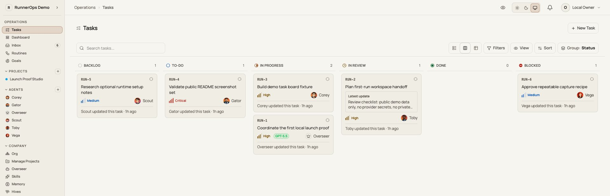
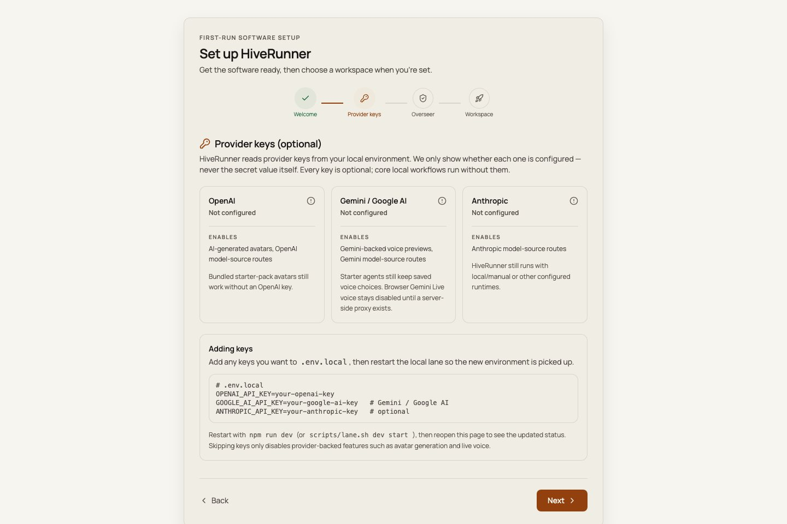
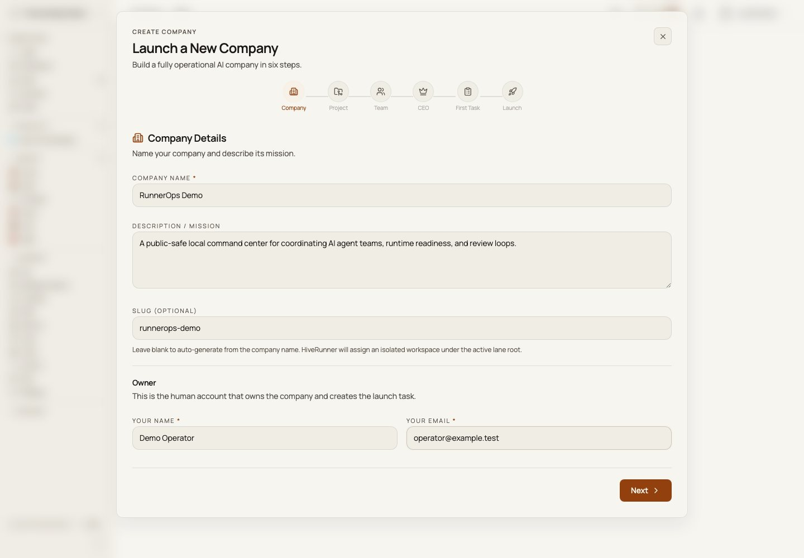
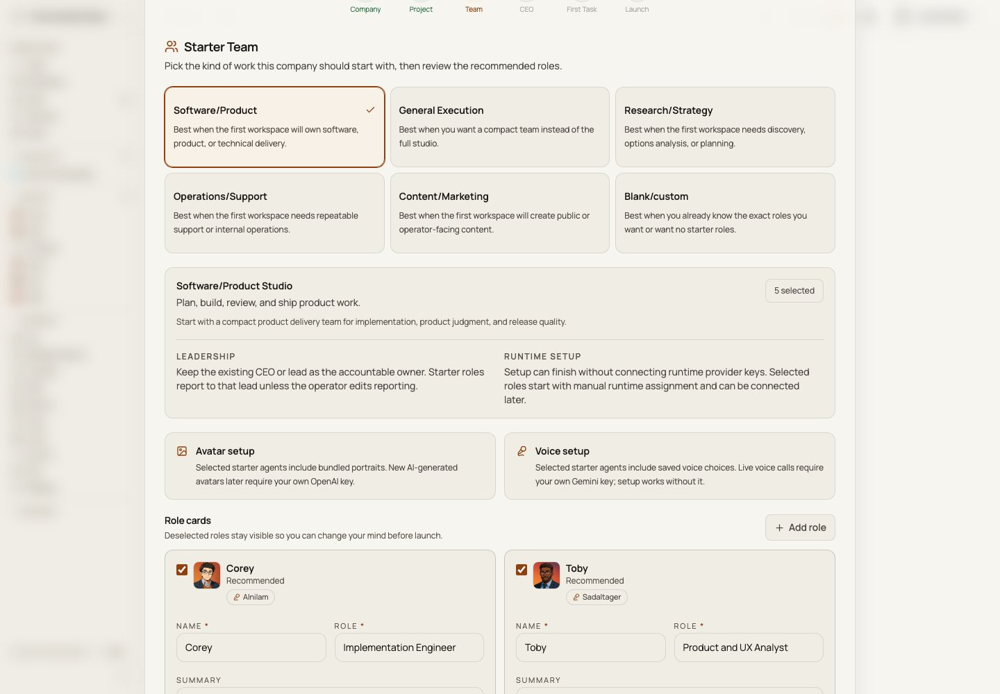
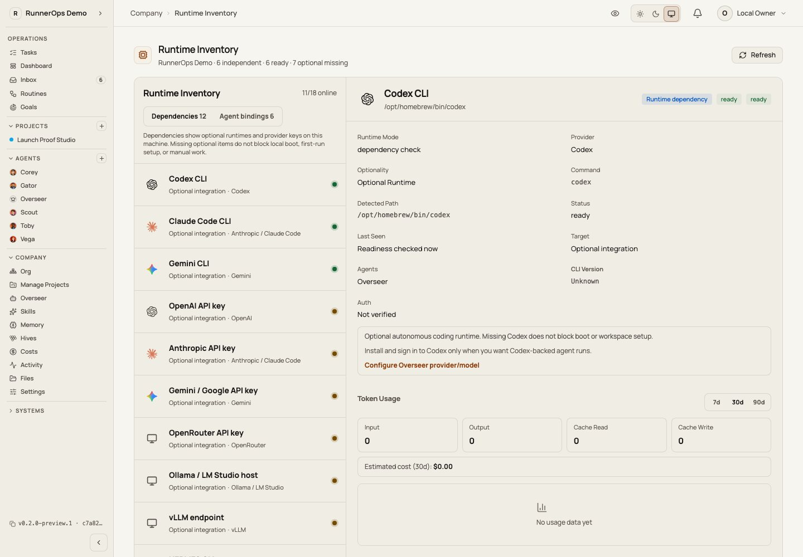
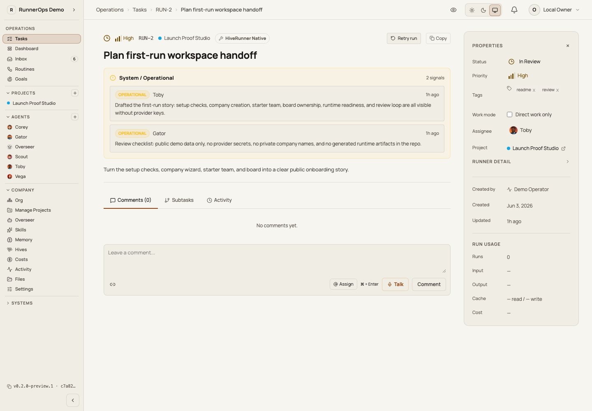

# HiveRunner

**Give your agents a goal. Get back a finished sprint.**

HiveRunner is the control plane for AI-agent sprints. It turns one goal into a
sprint plan, splits it into tasks, and assigns your agents — Codex, Claude Code,
Gemini, and the CLIs you already run — then executes the work on a lane you own
and keeps every result reviewable.

> **Automate the sprint. Keep the review.**

HiveRunner is built for developers and technical operators who are past toy
chatbots and want a real console for coordinating AI work on their own machine.
It is local-first by default — clone it, run it locally, and connect the runtimes
and API keys you want. No hosted account is required to start.



_Public-safe RunnerOps demo: starter agents, task ownership, review state, and
runtime-ready work are visible from one local control center._

## What You Can Do In The First 10 Minutes

After a fresh clone, you can:

- boot HiveRunner locally with no Supabase project, OAuth app, or provider key;
- enter the first-run software setup walkthrough;
- create or open a workspace/company when you are ready;
- choose a starter team with bundled portraits,
  saved voice choices, and role instructions;
- inspect runtime readiness for Codex, Claude Code, Gemini, Hermes, OpenClaw, or
  external runners;
- see where tasks, goals, memory, costs, files, reviews, and runtime lanes live;
- decide which optional integrations you actually want to configure.

The goal is fast evaluation without fake magic. Missing optional CLIs or API keys
show up as setup work, not as broken onboarding.

## Product Tour

The screenshots below use a deterministic, public-safe local demo workspace with
no real provider keys, secrets, or private company data.



_Fresh local setup separates software readiness from workspace creation and
shows provider keys as optional._



_The company wizard creates the local workspace, owner context, starter team,
CEO, and first task only when you choose to launch it._



_Starter packs give a new workspace useful agent roles, bundled portraits, and
manual-runtime defaults without requiring avatar or voice provider keys._



_Runtime Inventory shows optional CLIs and provider keys as ready, missing, or
needs attention before a workflow depends on them._



_Task detail keeps ownership, review notes, comments, and run usage close to the
work being reviewed._

## Why HiveRunner Exists

AI coding agents are powerful one chat at a time. But real work isn't one chat —
it's a sprint: many tasks, many agents, context that has to survive handoffs, and
output someone actually has to review. Run that across a pile of terminal tabs,
prompt logs, and one-off scripts and it quickly becomes an operations problem:

- which agent owns which task?
- what context did it use?
- what did it change?
- what needs review?
- which runtime is authenticated and healthy?
- what is local state versus hosted state?
- how much are the agents spending?

HiveRunner gives that work a structure. Goals become sprint plans, sprint plans
become tasks, tasks run through your agents, and every run stays visible and
reviewable in one operator console.

## How It Works

```text
   Goal  ─▶  Sprint plan  ─▶  Tasks  ─▶  Agents + runners  ─▶  Runs  ─▶  Review
 (objective)  (scoped unit)  (the board)  (Codex/Claude/…)  (on a   (you sign
                                                             lane you  off)
                                                             own)
```

1. **Define a goal.** A project or company objective (created during onboarding).
2. **HiveRunner proposes a sprint plan.** The goal becomes a scoped, plannable
   unit of work — not a flat to-do list.
3. **The sprint splits into tasks.** Typed, prioritized, tracked on a board.
4. **Agents take the tasks.** Each task is assigned to an agent and a runner
   (Codex, Claude Code, Gemini, Hermes, or an external runner), routed by role
   and model.
5. **Runs execute on a lane you own.** Execution happens on the stable execution
   lane; observer lanes stay read-only.
6. **You review before it's done.** Work moves through review states — agent
   output is never auto-accepted. Memory and cost carry into the next sprint.

## Core Features

- **Goal-to-sprint orchestration** — turn a goal into a sprint plan, split it
  into tasks, assign agents, and track every run through to review.
- **Bring-your-own runners** — coordinate Codex, Claude Code, and Gemini as
  first-class runners, plus Hermes, OpenClaw, and any external CLI through the
  runner boundary. Each appears as a readiness state, so you wire up only what
  your sprint needs.
- **Review loops** — route work through review states instead of treating every
  agent output as automatically done. Agent output is never silently accepted.
- **Agent team management** — create agents, assign work, keep roles and context
  visible, and make handoffs explicit.
- **Run visibility & cost tracking** — inspect execution runs, context,
  comments, and artifacts, and see what each sprint is spending.
- **Memory and file surfaces** — keep durable context, files, and decisions
  close to the work they support, and carry them into the next sprint.
- **Local-first control plane** — SQLite-backed local state with a single-owner
  default mode; execution runs on a lane you own, with no hosted account
  required to boot.
- **Starter agent packs** — launch with public-safe curated agent identities,
  bundled avatars, saved voice choices, and neutral role instructions without
  needing image or voice provider keys.
- **Optional voice and avatar features** — configure your own keys/backends when
  you want voice-enabled agent interaction; ignore them when you do not.
- **Hosted-auth path** — Supabase auth is available for hosted multi-user
  experiments, but it is not required for the local path.

## Requirements

- Node.js 22 LTS.
- npm.
- macOS or Linux for the local runtime scripts.

Optional integrations can require their own CLIs or API keys. They are not
required to boot the app.

## Quickstart

```bash
git clone https://github.com/timharris707/hiverunner.git
cd hiverunner
cp .env.example .env.local
npm ci
npm run dev
```

Open [http://localhost:3010](http://localhost:3010).

With the default `.env.example`, HiveRunner runs in `local-single-user` mode.
On a fresh local install, `/` sends you to `/setup` for the one-time software
setup walkthrough. No Supabase project, OAuth app, password, or admin account is
required for the local path.

`/setup` and `/companies/new` are intentionally different flows. `/setup`
checks the local software lane, optional provider-key status, the bundled
public-safe Overseer skill, and the handoff to a workspace choice. When a
workspace is created, HiveRunner seeds the Overseer as an active company skill
and exports it into that workspace when a workspace root is available.
`/companies/new` is the workspace/company wizard where you define the company,
team, CEO, and first task.

During company creation, HiveRunner can create a starter agent pack such as
Software/Product Studio, Solo Operator Copilot, Research & Strategy Desk,
Operations/Support, or Content/Marketing. These starter agents use bundled
public-safe avatar images and saved voice IDs so a fresh workspace feels alive
immediately. The Blank/custom option creates no extra starter agents.

Port `3010` is the local UI/build lane. It is forced observer-only so it can
stay responsive while you edit, test, and inspect the app. Autonomous execution
belongs to a separate execution owner such as the stable `3001` lane or an
explicit isolated execution lane.

For a script-managed background dev lane with PID/log files, use:

```bash
scripts/lane.sh dev start
scripts/lane.sh dev status
scripts/lane.sh dev logs
```

The script-managed `dev` lane is an internal build/UI lane and remains
observer-only. Do not use `3010` as an execution owner.

For optional Docker or Node-permission isolation, see
[docs/runtime-isolation.md](docs/runtime-isolation.md).

## First Places To Look

Useful local routes after boot:

- `/login` — auth entry point.
- `/setup` — first-run software setup.
- `/companies/new` — create a workspace/company and review a starter team.
- `/<CODE>/tasks?view=board&group=status` — default task board after setup and workspace creation.
- `/<CODE>/dashboard` — dashboard for a workspace once it has been opened or populated.
- `/<CODE>/tasks` — task board/list views.
- `/<CODE>/goals` — workspace goals and supporting sprints.
- `/<CODE>/memory` — memory workspace.
- `/<CODE>/hives` — runtime/provider configuration.
- `/<CODE>/runtime-inventory` — optional CLI/runtime readiness.

Existing local data may still use older workspace routes when you point
HiveRunner at an existing data directory.

## Version, Build, And Feedback

HiveRunner shows the current app version and build identifier in the lower-left
sidebar. Click it to copy diagnostics such as version, build tag, commit, lane,
mode, and port. Include that copied block whenever you file feedback.

See [CHANGELOG.md](CHANGELOG.md) for the public release notes and recent
share-build changes.

Use GitHub issues for share-build feedback:

- Bug report: broken behavior, regressions, console errors, or setup failures.
- Feature request: product/workflow improvements.
- First-run feedback: anything confusing from a fresh clone or first local lane.

The issue forms live under `.github/ISSUE_TEMPLATE/` and ask for the same
diagnostics the app can copy from the sidebar.

## Configuration

Most local installs can start with the checked-in `.env.example` copied to
`.env.local`.

### Required For Local Boot

None beyond copying `.env.example` to `.env.local`.

`MC_AUTH_MODE` is intentionally unset by default. When unset, HiveRunner uses
`local-single-user` mode.

### Recommended Local Settings

```env
# Optional, but useful if you want a stable owner email in local state.
MC_LOCAL_OWNER_EMAIL=owner@localhost.local

# Optional. Use an absolute path for company workspaces.
MC_WORKSPACE_ROOT=/absolute/path/to/hiverunner/workspace

# Optional. Use a separate data dir when testing a fresh local lane.
MC_DATA_DIR=./data-dev

# Optional. Force `/` to prefer a specific existing workspace/company code.
MC_DEFAULT_COMPANY_CODE=RUN
```

### Agent And Automation Traffic

Set `MC_API_KEY` when agents, scripts, or other machines call protected
orchestration APIs from outside exact loopback.

```env
MC_API_KEY=generate-a-long-random-secret
```

Exact loopback calls on your own machine keep working in local-single-user mode.

### Optional Provider Keys

Only set these when you want the corresponding feature. Local boot, workspace
creation, and starter-team setup do not require provider keys.

```env
OPENAI_API_KEY=your-openai-key
GOOGLE_AI_API_KEY=your-google-ai-key
ANTHROPIC_API_KEY=your-anthropic-key
```

`GOOGLE_AI_API_KEY` enables Gemini-backed server-side voice previews and direct
Google/Gemini model-source routes. Browser Gemini Live voice remains disabled
until a server-side proxy/session-token adapter is added. Voice is optional;
agents can be created and used without it.

`OPENAI_API_KEY` can enable optional AI avatar generation where configured.
Without an image provider key, bundled starter-pack avatars and local/default
avatar options still work.

The optional Pipecat/Tavus voice-avatar backend lives in `pipecat-server/` and
is documented in [docs/voice-avatar-backend.md](docs/voice-avatar-backend.md).
HiveRunner does not require that backend for local boot.

### Supabase Mode

Supabase is optional. Use it only for hosted multi-user auth experiments.

```env
MC_AUTH_MODE=supabase
NEXT_PUBLIC_SUPABASE_URL=https://your-project.supabase.co
NEXT_PUBLIC_SUPABASE_ANON_KEY=your-anon-public-key
# Optional: only for audited admin provisioning paths.
SUPABASE_SERVICE_ROLE_KEY=your-service-role-key
```

When `MC_AUTH_MODE=supabase`, `/login` shows email/password and Google OAuth.
Public signup is disabled by design; users should be provisioned by an admin.

## Runners

Bring the agents you already run. HiveRunner coordinates Codex, Claude Code, and
Gemini as first-class runners, plus Hermes, OpenClaw, and any external CLI
through the runner boundary. Every runner is optional and appears as a readiness
state — live when its CLI is installed and authenticated, clearly flagged when
it is not. Missing CLIs are degraded/missing-optional states, not boot failures,
so you wire up only what your sprint needs.

| Runtime | Command | Required? | Notes |
|---|---|---:|---|
| Codex | `codex` | No | First-class runner; preferred for GPT coding work, falls back to Claude/Sonnet when the `codex` CLI is not on `PATH`. |
| Claude Code | `claude` | No | First-class runner. Runtime auth is separate from `ANTHROPIC_API_KEY`. |
| Gemini CLI | `gemini` | No | First-class runner; Gemini API keys are separate and can also power voice/direct Google routes. |
| Hermes | `hermes` | No | Provider-neutral ACP runner. |
| OpenClaw | `openclaw` | No | Provider-neutral gateway runner. |
| External runner | configured command/env | No | Plug any external execution system in through the runner boundary. |

Check `/<CODE>/runtime-inventory` or `/<CODE>/hives` after boot to see which
runtimes are ready, missing, or waiting for login. For the full classification,
see [docs/runtime-dependencies.md](docs/runtime-dependencies.md).

## Validation Commands

For a first local validation, run:

```bash
npm ci
npm audit --json
npx tsc --noEmit --incremental false --pretty false
npm run build:tracked
```

`npm run build:tracked` exports committed files into a temporary directory, runs
`npm ci`, then runs audit, typecheck, and build from that tracked-only tree. It
is the safest public validation path because it ignores local databases, logs,
workspaces, screenshots-in-progress, and other untracked state.

The broader test suite is useful for development but can be slower and more
specialized:

```bash
npm test
npm run test:auth
npm run test:e2e:smoke
```

## Current Boundaries

HiveRunner is useful, but it is not pretending to be finished hosted
infrastructure. Important limits:

- SQLite is the primary local store. It is good for a local operator lane on a
  local disk, not a multi-tenant hosted service at scale.
- The runtime engine is single-process oriented. Run only one process with
  ticks enabled for a given `MC_DATA_DIR`. The local `3010` lane is forced
  observer-only; use stable `3001` or a separate isolated execution lane for
  active work.
- Hosted Supabase auth exists, but local-single-user is the default sharing
  path. Supabase auth alone does not make HiveRunner horizontally scalable.
- Runtime integrations depend on local CLIs or provider keys being present.
  Missing optional runtimes are expected until configured.
- First-run software setup is intentionally narrow: `/setup` checks local mode,
  optional provider-key status, the bundled public-safe Overseer skill, and the
  workspace handoff. Workspace creation seeds and exports the active company
  skill separately. `/companies/new` remains the separate workspace/company
  wizard for creating a team and first task.
- Docker and Node-permission entry points are available for defense in depth,
  but the default local path remains a trusted local-machine workflow.

For the exact supported boundary and the B5/B6 audit, see
[docs/local-first-boundary.md](docs/local-first-boundary.md).

## Local Data And Workspaces

By default, local runtime data is stored under the app data directory. Set
`MC_WORKSPACE_ROOT` when you want company workspaces in a specific location:

```text
/absolute/path/to/hiverunner/workspace
```

Set `MC_DATA_DIR` when you want an isolated SQLite/data lane for testing. Keep
active SQLite data on a local disk. If you back up a running lane, include the
database file and its `-wal` and `-shm` sidecars, or stop the process before
copying the data directory.

## Memory Sync

The company Memory page includes **Sync now** and **Re-index** controls. Use
them after connecting or editing the company vault so HiveRunner can refresh the
indexed cards, graph, search, and retrieval evidence. The page shows the last
indexed time, indexed file count, latest sync summary, and errors.

If you call the memory sync API from a script instead of the browser, preserve
the local same-origin signal or use an API-key-authenticated path:

```bash
curl -X POST \
  -H "Origin: http://127.0.0.1:3010" \
  -H "Content-Type: application/json" \
  http://127.0.0.1:3010/api/orchestration/companies/RUN/memory/sync \
  -d '{}'
```

Browser clicks handle this automatically. Plain `curl` without an `Origin`,
`Referer`, or valid API key is expected to fail CSRF protection.

## Project Structure

```text
hiverunner/
  src/
    app/              Next.js App Router pages and API routes
    components/       Shared UI and orchestration components
    config/           Branding and agent defaults
    lib/              Auth, orchestration, workspace, runtime, and data logic
  docs/               User docs, operator notes, and engineering references
  pipecat-server/     Optional voice-avatar backend
  public/             Logos, icons, static assets
  scripts/            Local runtime, test, and maintenance scripts
  data/               Local state directory; instance data is gitignored
  .env.example        Local configuration template
```

## Documentation

Start with [docs/README.md](docs/README.md). The docs index separates the public
operator path from deeper engineering notes and compatibility references.

High-value docs:

- [Auth modes](docs/AUTH.md)
- [Runtime dependencies](docs/runtime-dependencies.md)
- [Local-first boundary](docs/local-first-boundary.md)
- [Operations](docs/OPERATIONS.md)
- [Voice/avatar backend](docs/voice-avatar-backend.md)
- [Security policy](SECURITY.md)

## Troubleshooting

### Port 3010 Is Busy

Stop the existing local server:

```bash
scripts/lane.sh dev stop
```

Or run a one-off foreground server on another port:

```bash
PORT=3011 npm run dev
```

### Login Shows Hosted Auth Instead Of Local Continue

Check `.env.local`. For the local-first path, leave `MC_AUTH_MODE` unset or set
it to `local-single-user`. Set `MC_AUTH_MODE=supabase` only when Supabase is
fully configured.

### Runtime Or Provider Shows Missing

That usually means an optional CLI or provider key is not installed. The app can
still boot; configure the provider only when you need that runtime.

### You Want A Cleaner Local Test Lane

Use a separate data directory:

```bash
MC_DATA_DIR=./data-dev npm run dev
```

## Security Notes

- Keep `.env.local` private.
- Set `MC_API_KEY` before allowing non-loopback agent or automation traffic.
- Use `MC_AUTH_MODE=supabase` for any hosted multi-user deployment.
- Do not expose local-single-user mode directly to the public internet.
- Treat `data/`, `data-dev/`, and workspace directories as private runtime
  state.

## Contributing

Keep changes scoped and verifiable. For share-readiness work, prefer fixes that
make a fresh clone safer, clearer, or more trustworthy before expanding feature
surface area. See [CONTRIBUTING.md](CONTRIBUTING.md).

## License

MIT. See [LICENSE](LICENSE).
